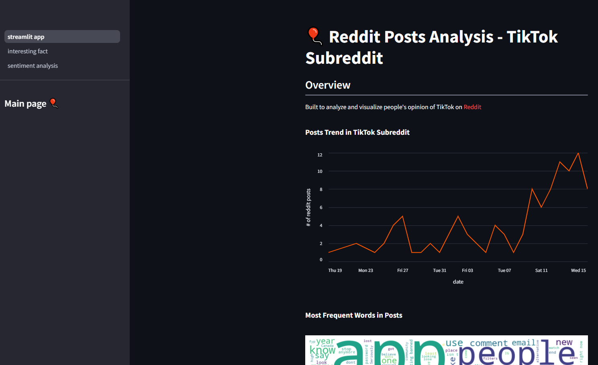

# Reddit-Posts-Analysis

This analysis aims to understand and visualize the current trends and people's throught on TikTok ban in the U.S by scraping posts data from a subreddit, TikTok. I created streamlit app to visualize scraped data. 

<p float="left">
    
    
</p>

[](https://glowing-space-xylophone-x4vj796xwqrf65gp-8501.app.github.dev/)

What my streamlit app looks like:



I included a sample data (subreddit_2025-01-17.json) I've scraped using main.py

In order to run the script, you will have to download the compatible [chrome webdriver](https://sites.google.com/chromium.org/driver/).

To scrpe the data, run:
```
$ python main.py
```

By default it will scrape reddit posts in TikTok subreddit this month, scrolling down 30 times (~400 posts). You can go back to main.py to change those parameters. However, it is recommended to keep max_scroll=1 as increase max_scroll will cause partially missed scraping result due to the nature of this website. It is also recommended to test out different time interval between each request using time.sleep() in main.py (too many requests may quickly result in HTTP 429)

Next Step:
- some scraped html doesn't fit the json format, debug and find workarounds
- build a pipeline to ingest data on a regular basis
- update data cleaning